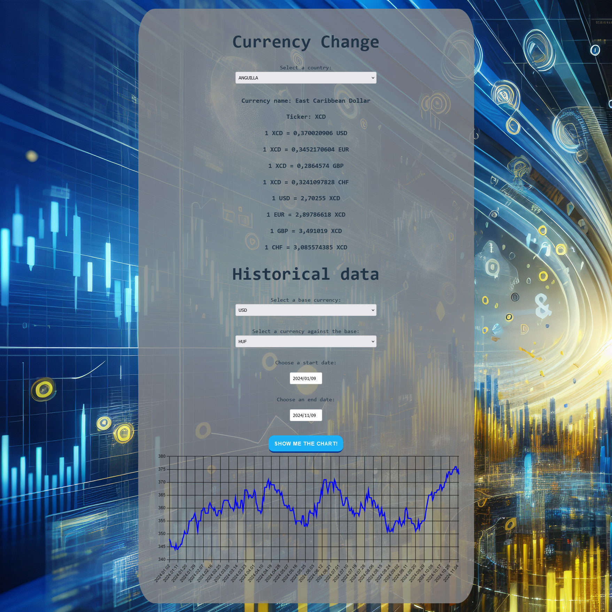

Currency Exchange Rate App
==========================



This application allows users to view current and historical currency exchange rates. The app fetches data from Google Sheets using the Google Sheets API, dynamically updates currency rates, and displays them in a chart using Chart.js.

Features
--------

*   **Select Country**: Choose a country to view currency details like exchange rates with USD, EUR, GBP, and CHF.

*   **Historical Data**: Select base and target currencies, choose a date range, and visualize historical exchange rate data in a line chart.

*   **Google Sheets Integration**: The app adds a Google Finance formula to a Google Sheet for real-time currency data retrieval.


## Technologies
------------

**Frontend**

[](https://developer.mozilla.org/en-US/docs/Web/JavaScript)
[](https://reactjs.org/)
[](https://reactdatepicker.com/)
[](https://www.chartjs.org/)

**Backend**

[](https://expressjs.com/)

**Database**

[](https://developers.google.com/sheets/api)

**API Integration**

[](https://developers.google.com/sheets/api)
[](https://www.google.com/finance)


Setup and Installation
----------------------

### Prerequisites

*   Node.js and npm

*   Docker and Docker Compose

*   Google Cloud Project with Sheets API enabled

*   Google Sheets API credentials (client ID, API key)


### Docker Setup

This application includes [Docker](https://www.docker.com/) support for both the backend and frontend services. Ensure Docker is installed and running on your system.

#### Building and Running the Docker Containers

1. **Clone the repository**:
   ```shell
   git clone <repo_url>
   cd <project_folder>
   ```

2. **Contact the project maintainer to receive valid API keys**. Once you have the keys, add them to the `.env.sample` file in the project root and rename the file to `.env`.

3. **Run the containers using Docker Compose**:
   ```shell
   docker-compose up --build
   ```

   This will start both the backend and frontend services. The app will be available at http://localhost:3000.

### API Endpoints

*   **GET /data**: Fetches a list of countries and their currency details from Google Sheets.
*   **POST /add**: Adds a Google Finance formula to the Google Sheet for fetching currency exchange rates.
*   **GET /historical**: Fetches historical exchange rate data from Google Sheets.

### Usage

*   **Select a Country**: Choose a country from the dropdown to view its exchange rates.
*   **View Currency Exchange Rates**: The app will display exchange rates between the selected country's currency and USD, EUR, GBP, and CHF.
*   **View Historical Data**: Choose a base currency, a target currency, and a date range, then click "Show me the chart!" to visualize the historical exchange rate data.

